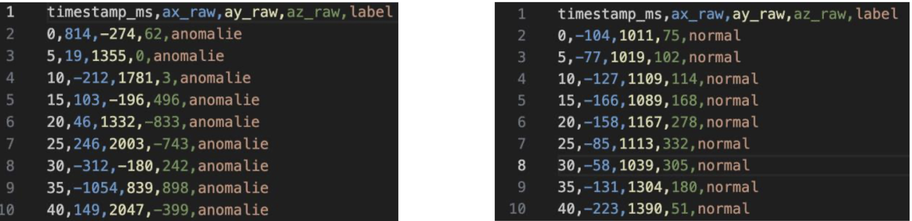
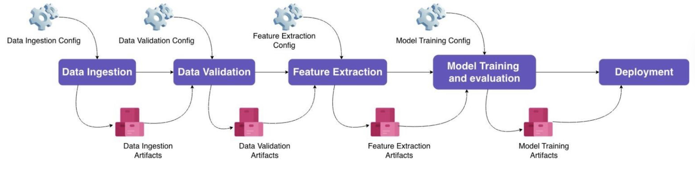
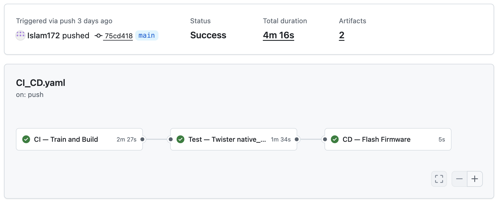
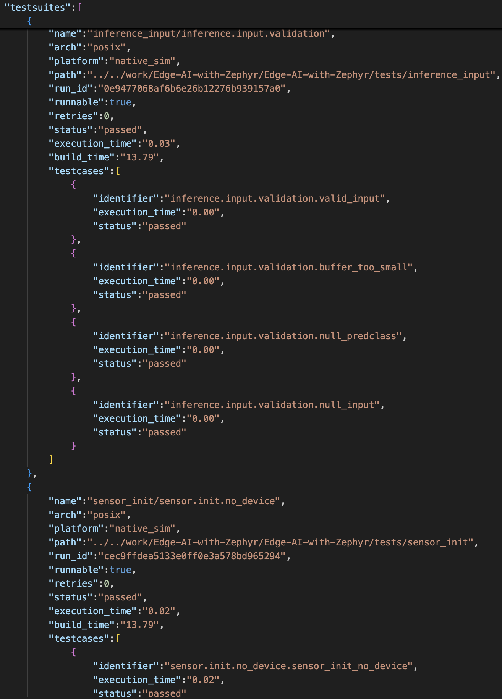

# Edge AI mit Zephyr: Anomalieerkennung auf Mikrocontroller

> Ein End-to-End Edge-AI-Projekt: Von der Datensatzerfassung über das Modelltraining
> bis zur automatisierten Bereitstellung auf einem eingebetteten System.

---

## Über dieses Projekt

Dieses Projekt entstand im Rahmen meines Praktikums und verbindet zwei Themenbereiche, die ich vertiefen wollte: **Edge AI** und **MLOps**.

Das Ziel: Ein KI-Modell erkennt in Echtzeit ob ein Lüfter normal läuft oder eine Anomalie
vorliegt.

**Transparenzhinweis:** Die Implementierung der Programmcode-Module wurde mit KI-Unterstützung erarbeitet. Mein Beitrag liegt in den Ingenieurstätigkeiten:
Systemarchitektur, Technologieauswahl und -begründung, MLOps-Pipeline-Design,
und CI/CD-Integration.
Das Ziel war nicht das Schreiben von Code, sondern das Denken und Entscheiden als Ingenieur.

---

## Hardware

**NXP FRDM-MCXN947** Mikrocontroller mit angeschlossenem Beschleunigungssensor,
montiert auf einem Lüfter zur Schwingungserfassung.

- Mikrocontroller: NXP FRDM-MCXN947 (ARM Cortex-M33, 150 MHz)
- Sensor: 3-Achsen-Beschleunigungssensor (I²C)
- Anwendung: Lüfter-Anomalieerkennung durch Vibrationsmessung

---

## Systemarchitektur

Der Datenfluss vom Sensor bis zur Entscheidung:
**Sensordaten → Vorverarbeitung → Modell → Klassifikation → Aktion**

---

## Datensatz

Trainingsdaten wurden direkt vom Sensor erfasst — zwei Klassen:

- **Normal**: Lüfter läuft regulär
- **Anomalie**: Lüfter blockiert oder unausgewuchtet

Rohdaten: 3-Achsen-Beschleunigung (Ax, Ay, Az) bei 200 Hz Abtastrate,
aufgezeichnet über eine serielle Schnittstelle und als CSV gespeichert.

---

## MLOps-Pipeline

Die Python-Pipeline folgt MLOps-Best-Practices mit klar getrennten Stufen,
konfigurierbaren Parametern und versionierten Artefakten pro Schritt.
Jede Stufe liest Artefakte der vorherigen Stufe und erzeugt eigene.
Das ermöglicht reproduzierbare Experimente und eine lückenlose Nachvollziehbarkeit.

| Stufe | Was passiert |
|---|---|
| **Data Ingestion** | Sensordaten werden aus Dateien geladen, vereinheitlicht und in Normal- und Anomalie-Klassen aufgeteilt |
| **Data Validation** | Die Daten werden automatisch auf Vollständigkeit und Korrektheit geprüft, bevor sie weiterverarbeitet werden |
| **Feature Extraction** | Aus den Rohdaten werden die relevanten Merkmale berechnet, die das Modell später zur Erkennung nutzt |
| **Model Training** | Ein KI-Modell wird trainiert, bewertet und automatisch optimiert — Metriken werden mit MLflow nachverfolgt |
| **Deployment** | Das trainierte Modell wird automatisch in ein Format konvertiert, das direkt auf dem Mikrocontroller ausgeführt werden kann |

Jede Stufe erzeugt eigene Artefakte — das ermöglicht reproduzierbare Experimente
und eine lückenlose Nachvollziehbarkeit der Ergebnisse.

---

## ML-Engine: emlearn statt TensorFlow

Für dieses Projekt wurde bewusst **emlearn** statt **TensorFlow Lite Micro** gewählt.

**Warum emlearn?**

Für dieses Projekt wurde bewusst **emlearn** gewählt. Das ist eine Open-Source-Bibliothek
die es ermöglicht, klassische Machine-Learning-Modelle direkt auf Mikrocontrollern
auszuführen.

Der Vorteil gegenüber neuronalen Netzen auf Mikrocontrollern: deutlich geringerer
Ressourcenverbrauch bei vergleichbarer Genauigkeit für diese Aufgabenklasse.

Erfahrung mit TensorFlow bringe ich aus Kursen und anderen Projekten mit. emlearn wurde hier bewusst
als Alternative gewählt um klassische ML-Ansätze im Kontext von Edge-AI zu erkunden.

---

## Von MCUXpresso zu Zephyr

Das Projekt wurde zunächst erfolgreich auf der **NXP MCUXpresso IDE** entwickelt
und auf dem FRDM-MCXN947 Board getestet. Anschließend erfolgte eine Portierung im Rahmen meiner Bachelorarbeit auf das Framework **ZephyrRTOS**.

**Warum Zephyr?**

Zephyr ist heute in der Embedded-Industrie eines der relevantesten Open-Source-RTOS:

- **Linux Foundation Projekt** mit Unterstützung von NXP, Intel, Nordic, ST und anderen
- **Herstellerneutralität**: Derselbe Applikationscode läuft auf Boards verschiedener Hersteller — Hardware wird über DeviceTree konfiguriert, nicht programmiert
- **Integrierte Testinfrastruktur**: Twister ermöglicht automatisierte Tests ohne physische Hardware
- **Industrierelevanz**: Zunehmend in Automotive, Industrie 4.0 und IoT eingesetzt

Die Portierung war nicht nur eine technische Übung, sondern sie zeigt einen
strukturellen Vorteil: Wenn ein Sensor abgekündigt wird oder das PCB-Layout sich ändert, bleibt der Applikationscode unverändert.

---

## CI/CD-Pipeline

Bei jedem Code-Update startet automatisch eine dreistufige Pipeline:

**1. Build** — Das KI-Modell wird neu trainiert und die Software
für das Gerät automatisch erstellt.

**2. Test** — Automatisierte Unit Tests prüfen die Software.

**3. Deployment** — Die fertige Software wird automatisch auf
den Mikrocontroller übertragen und ist sofort einsatzbereit.
Das Deployment auf das physische Gerät ist vorbereitet und wird
über einen lokal angeschlossenen Rechner ausgeführt.

---

## Testergebnisse

Zwei automatisierte Tests laufen bei jedem Build:

| Test | Beschreibung | Ergebnis |
|---|---|---|
| `sensor.init.no_device` | Sensor-Initialisierung gibt -ENODEV ohne Hardware | ✅ PASSED |
| `inference.input.validation` | Inference-Engine validiert fehlerhafte Eingaben korrekt | ✅ PASSED (4 Testfälle) |

Die Tests demonstrieren zwei DfT-Prinzipien (Design for Testability):
**Beobachtbarkeit** (definierte Rückgabecodes) und **Steuerbarkeit**
(Testzustände ohne Hardware herstellbar).

---

## Projektstruktur

Edge-AI-with-Zephyr/
├── src/
│ ├── sensor/ — Sensordaten erfassen und auslesen
│ ├── inference_engine/
│ │ └── emlearn/ — KI-Modell ausführen
│ └── main.c — Einstiegspunkt der Anwendung
├── Python_Pipeline/ — MLOps-Pipeline (Training → Deployment)
├── tests/ — Automatisierte Tests
├── boards/ — Hardware-Konfiguration je Board
├── .github/workflows/ — CI/CD Pipeline
├── CMakeLists.txt — Build-Konfiguration
├── Kconfig — Software-Konfiguration
├── prj.conf — Projektkonfiguration
├── prj_inf.conf — Konfiguration für Inferenzmodus
├── prj_log.conf — Konfiguration für Datenerfassungsmodus
└── west.yml — Abhängigkeiten und Module

---

## Kenntnisse die dieses Projekt demonstriert

- **Edge AI**: Modelltraining und Deployment auf Mikrocontrollern
- **MLOps**: Strukturierte Pipeline mit Artefakten und Reproduzierbarkeit
- **Embedded Systems**: Zephyr RTOS, DeviceTree, Kconfig, West, cmake
- **CI/CD**: GitHub Actions mit automatischem Build, Test und Deployment
- **Testing**: Zephyr Testinfrastruktur, unit tests, Design for Testability
- **Systemarchitektur**: Herstellerneutrale Embedded-Software-Architektur

---

